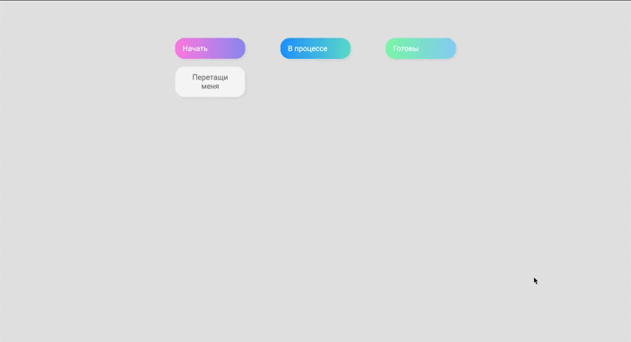

# marathon JS

## Introduction
Click on the name of the project and you will be taken to the CodePen website. There you can try all the projects.  
Picture gallery, to-do list base, picture slider, glowing squares, reaction game.

## Technology Stack
- HTML;
- CSS;
- JavaScript.

## View

[day01](https://codepen.io/sultanova6/pen/ExdOWMv)  
  
 

[day02](https://codepen.io/sultanova6/pen/XWxyGYw)  
  
 

[day03](https://codepen.io/sultanova6/pen/gOBZrqb)  
  
 

[day04](https://codepen.io/sultanova6/pen/NWOerPp)  
  
 

[day05](https://codepen.io/sultanova6/pen/mdzaEJJ)  
  
 